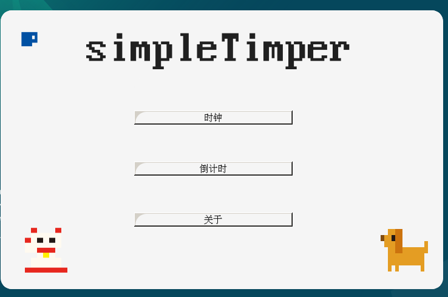
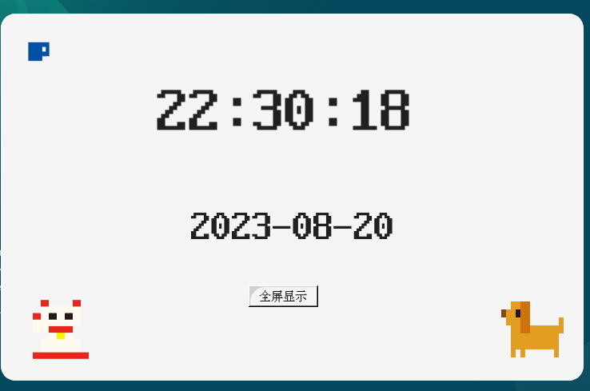
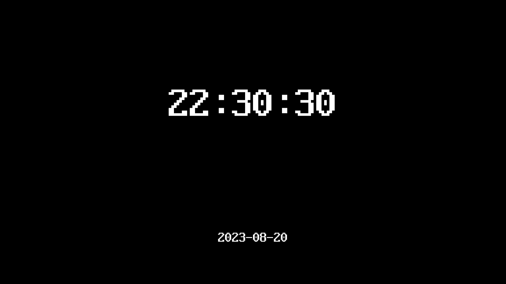

# SimpleTimer
这是一个简单的像素风时间显示与倒计时器，就像下图所展示的那样。主要特色是可以全屏显示内容，这是我在其他软件中没有找到的功能。
右上角杯子图标为返回上一级和退出按钮，全屏后只要按下ESC键便可以退出。




## 使用的
编程语言：python

所用的第三方库：pyside6

部分像素画来源：https://dotown.maeda-design-room.net

## 打包
建议大家使用 **nuitka** 来进行打包，下面给出打包方法。

**前提：** 安装c语言编译环境，如c++, gcc等。如果环境安装不全打包时会报错，具体请看日志。

建议大家使用虚拟环境进行安装，创建虚拟环境后运行以下命令即可完成打包，windows系统的可以使用我打包出来的文件。

先获取依赖：
```bash
pip install -r requirement.txt
```
开始打包：
```bash
python -m nuitka --windows-disable-console --output-dir=out --standalone --show-progress --enable-plugin=pyside6 Main.py
```
完成后请将工程目录下的 **asset** 目录复制到 **out** 目录下的 **Main.dist** 文件夹里即可。**Main.dist** 即是我们打包出的文件夹。

## 已知bug
linux的gnome桌面没办法移动应用程序，其余bug未知。

## 更新日志
### 8.21
美化了一些界面，并打包成了windows可执行文件供大家下载，但关于页面还没写。

### 8.20
这是第一版，只完成了基本内容，支持全屏显示时间，全屏倒计时等。更多细节还没有开发出来。
